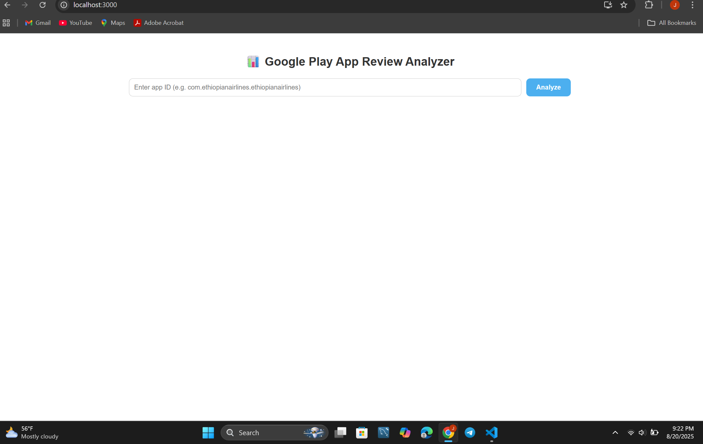
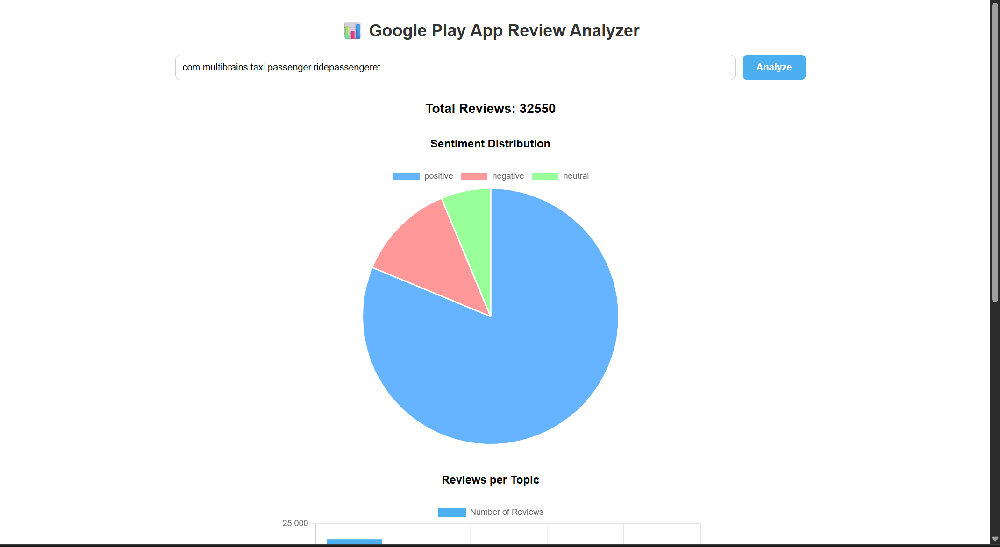
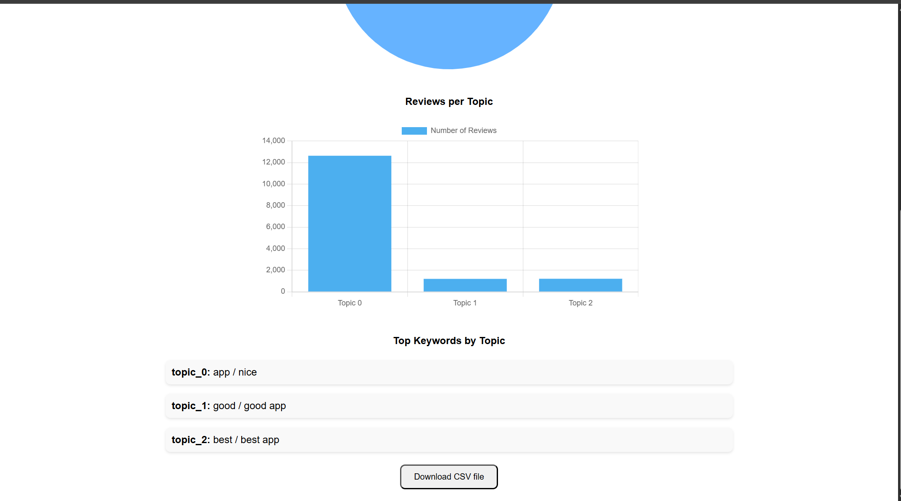

# 📊 App Review Sentiment & Thematic Analysis

This project is a **web application** that performs **sentiment analysis** and **thematic analysis** on mobile app reviews (e.g., from the Google Play Store).  
It helps visualize customer feedback through **charts, repetitive word analysis, and review summaries**, providing valuable insights for developers and businesses.

---

## 🚀 Features

- 🔎 **Fetch Reviews by App ID** – Input a Google Play Store app ID and fetch reviews automatically.  
- 📝 **Sentiment Analysis** – Categorizes reviews into positive, neutral, or negative.  
- 🎭 **Thematic Analysis** – Identifies recurring themes and common feedback points.  
- 📊 **Data Visualization** – Displays results with charts (pie charts, bar charts, word frequency graphs).  
- 🌍 **Download csv** – user can download the data preprocessed and the original review data.  
- ⚡ **Full Stack App** – Built with Node.js (backend) and React (frontend).

---

## 🛠️ Tech Stack

- **Frontend:** React.js, Chart.js / Recharts  
- **Backend:** fastAPI 
- **NLP:** Sentiment Models,tfidf,lematizer  
---

## 📂 Project Structure

```

.
├── backend/          FastAPI
│   ├── main.py
│   ├── analyser.py
│   └── ...
├── frontend/         # React frontend
│   ├── src/
│   └── public/
└── README.md         # Project documentation

````

---

## ⚙️ Installation & Setup

### 1️⃣ Clone the repository
```bash
git clone https://github.com/yabuz87/app-review-analyzer.git
cd NLP-task
````

### 2️⃣ Backend Setup

```bash
cd backend
 uvicorn main:app --reload (if FastAPI backend is used)
```

### 3️⃣ Frontend Setup

```bash
cd frontend
npm install
npm start
```

### 4️⃣ Open in Browser

```bash
http://localhost:3000
```

---

## 📸 Screenshots

### 🔹 Home Page



### 🔹 Review Analysis Result



### 🔹 Charts & Insights



---

## 📊 Workflow

1. User enters a **Google Play Store App ID** (e.g., `com.multibrains.taxi.passenger.ridepassengeret`).
2. The **backend** fetches reviews via API/web scraping.
3. **NLP models** process the text for:

   * Sentiment classification (Positive, Neutral, Negative).
   * Thematic grouping (common keywords & repetitive words).
4. The **frontend** visualizes results with **charts, tables, and word clouds**.
5. Insights are displayed with **actionable feedback for app developers**.

---

## 📌 Example Use Cases

* 📱 App developers analyzing customer satisfaction.
* 🏢 Businesses gathering user feedback for product improvements.
